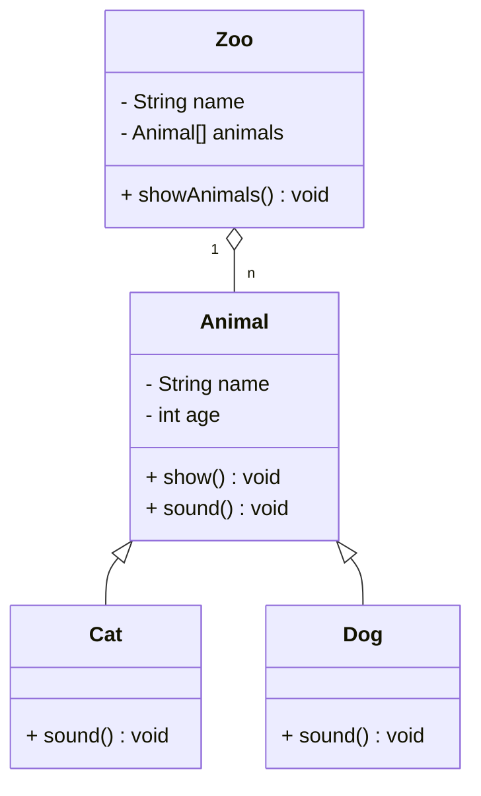

# OOP

## UML

```mermaid
classDiagram
direction TB
    class Animal {
	    - String name
	    - int age
	    + show() void
	    + sound() void
    }

    class Cat {
	    + sound() void
    }

    class Dog {
	    + sound() void
    }

    class Zoo {
	    - String name
	    - Animal[] animals
	    + showAnimals() void
    }

    Animal <|-- Cat
    Animal <|-- Dog
    Zoo "1" o-- "n" Animal
```
