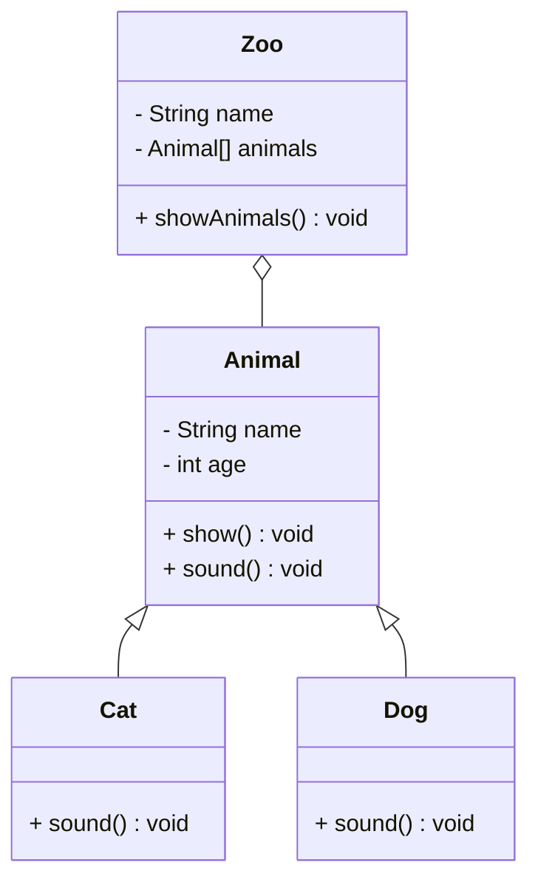

# OOP

## UML

```mermaid
classDiagram
    Animal <|-- Cat
    Animal <|-- Dog
    Zoo o-- Animal
    Animal : - String name
    Animal : - int age
    Animal: + show() void
    Animal: + sound() void
    class Cat {
        + sound() void
    }
    class Dog {
        + sound() void
    }
    class Zoo {
        - String name
        - Animal[] animals
        + showAnimals() void
    }
```
